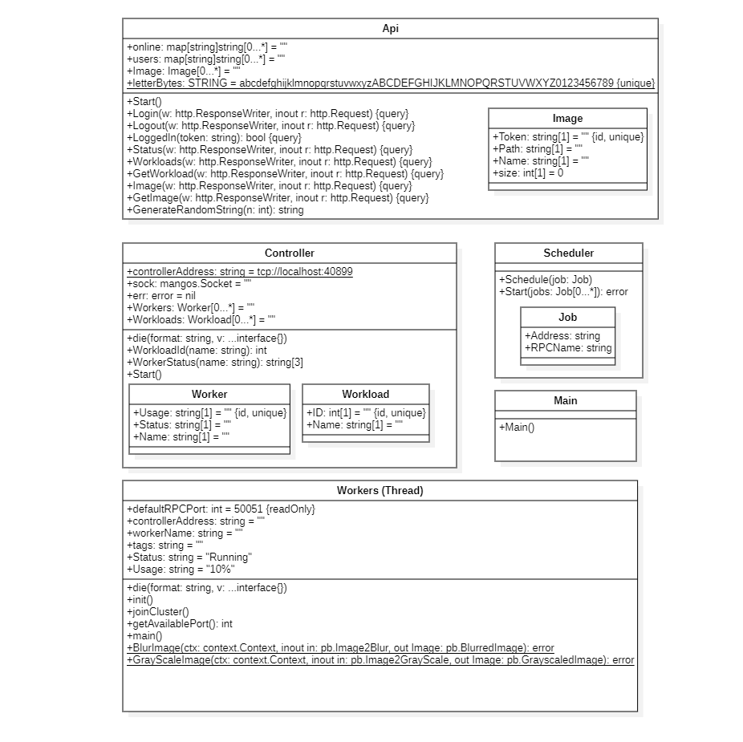

Architecture Document
=====================

The architecture of the API consists of a server that receives requests. It processes them and returns them to the clients.
- It has 7 basic functions:
   - `/ Login`
   - `/ Logout`
   - `/ Status`
   - `/ workloads`
   - `/ workloads/{workload_id}`
   - `/ images`
   - `/ images/{image_id}`